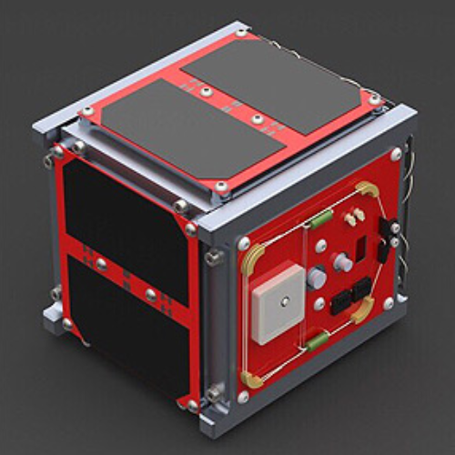

# CougSat1

This project covers my contributions the Washington State University Cougs in Space Club (2018-2020) and is part of NASA's [CubeSat Launch Initiative](https://nasa.gov/kennedy/launch-services-program/cubesat-launch-initiative).
A CubeSat is a miniature satellite intended for conducting scientific investigations in space.

## Author

[Jonathan Cochran](https://github.com/ionzzu)

## Description

There are three sections in this project:
1. [Attitude Determination and Control System (ADCS)](adcs): orients the satellite to a desirable position
2. [Engineering Drawings](engineering_drawings): drawings for existing CubeSat parts drawn to GD&T Drafting Standard
3. [Helmholtz Coil Structure](helmholtz_coil_structure): a testing structure to produce a 3-dimensional region of uniform magnetic field

## Installation

- Clone the repository

## Acknowledgment

Thank you to [Cougs in Space](https://cis.vcea.wsu.edu) and cooperation with NASA!
