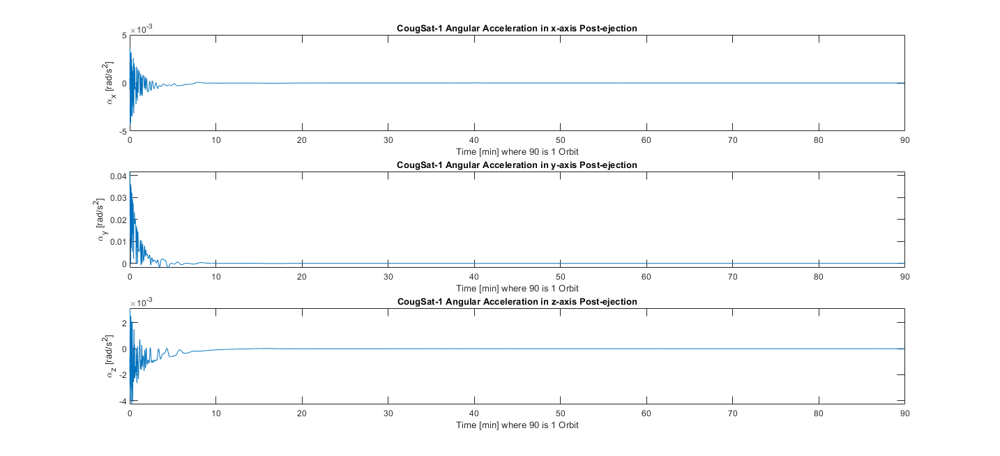
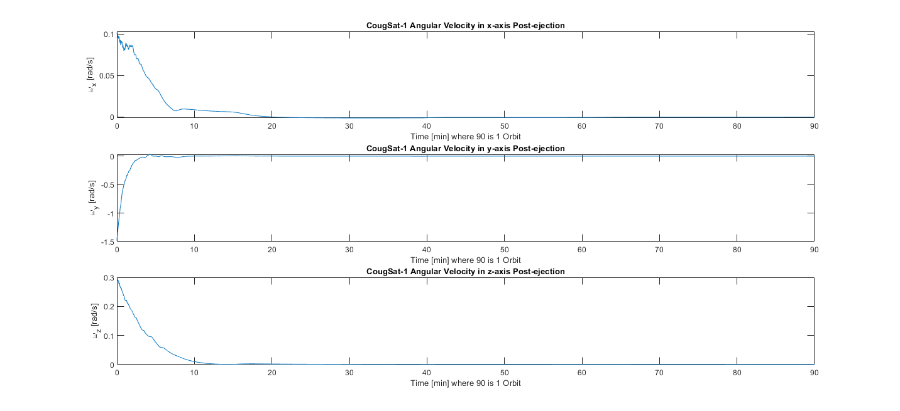
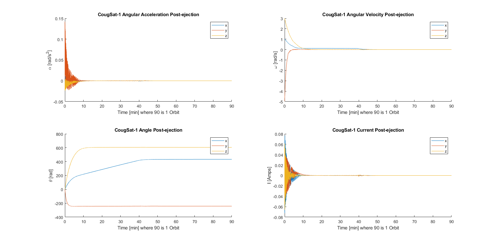

# Attitude Determination

This section covers the attitude determination and control system (ADCS).

## Author

[Jonathan Cochran](https://github.com/ionzzu)

## Description

### Background

- The ADCS orients the satellite to a desirable position
- Control is gained via three perpendicular magnetorquer coils
- These generate a magnetic field that interacts with Earth's magnetic field, inducing torque on the satellite

### Goals

- Develop a B-dot algorithm to detumble the satellite after ejection within one orbit

### Methodology

- The control algorithm presented is demonstrated in a simulated environment where the satellite is initially ejected in space
- All three axis are considered such that a magnetic field can be induced in any plane

#### Algorithm

1. Calculate Earth's magnetic field, secular variation, and local geomagnetic field vector
2. Translate the magnetic field vector to the satellite (body) frame of reference using direction cosine matrix
3. Calculate commanded magnetic dipole moment from the translated magnetic field vector
4. Determine torque required by magnetorquers and current required in each coil axis from the dipole moment
5. Calculate updated angular acceleration from the torque to produce from magnetorquers
6. Update current, angular position, angular velocity, and angular acceleration matrices

## Results

- Detumbled satellite in under a third of a rotation during simulation

## Base Environment Requirements

- MATLAB R2017b or higher

- Aerospace Toolbox

## Installation

1. Clone the repository

2. Run bdot_control_algo.m

## Acknowledgments

- IGRF determined using Drew Compston's [IGRF Model](https://www.mathworks.com/matlabcentral/fileexchange/34388-international-geomagnetic-reference-field-igrf-model)
- Framework for B-dot algorithm derived from catnip-evergreen's [bdot-algo](https://github.com/catnip-evergreen/bdot-algo)
