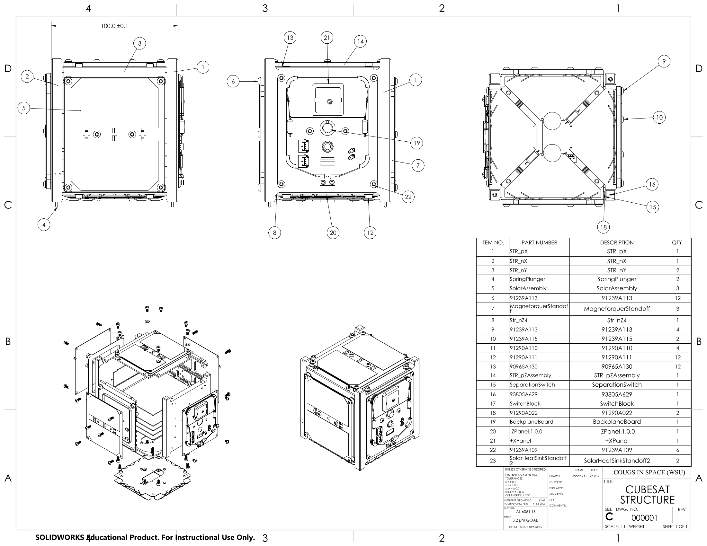
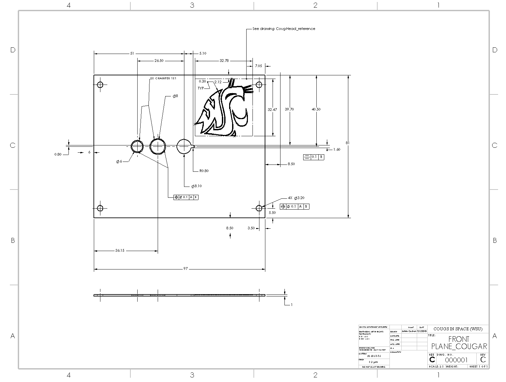
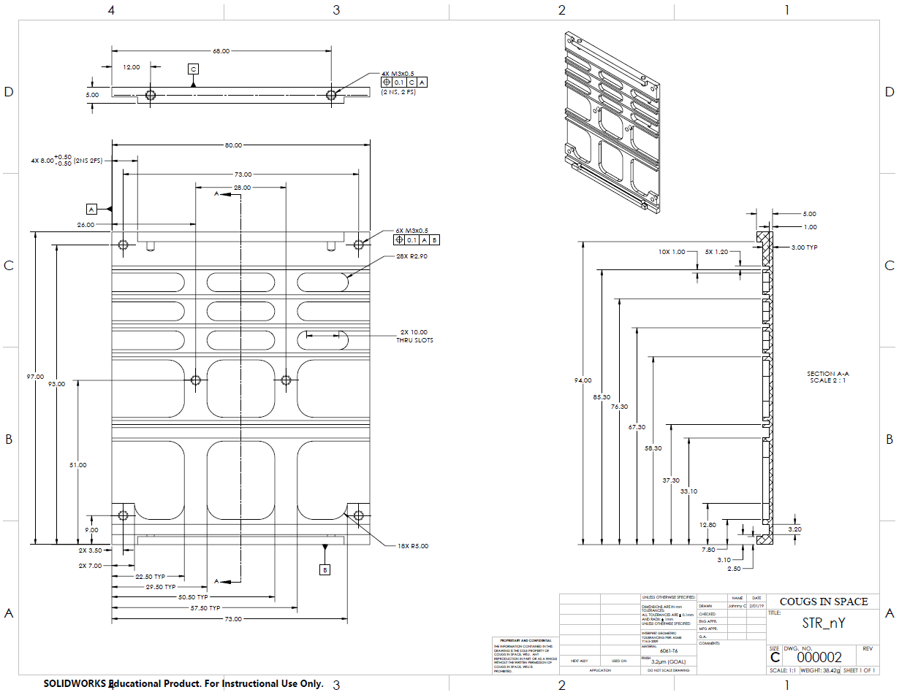

# Attitude Determination

This section covers the engineering drawings completed for part machining.

## Author

[Jonathan Cochran](https://github.com/ionzzu)

## Description

There are three engineering drawings I completed:
- [CubeSat Structure Assembly](#cubesat-structure-assembly)
- [Front Plane with Cougar Emblem](#front-plane-with-cougar-emblem)
- [STR_nY](#str_ny)

## CubeSat Structure Assembly

Exploded assembly drawing for the entire CougSat1 satellite.

See [CubeSat Structure directory](../engineering_drawings/cubesat_structure)

## Front Plane with Cougar Emblem

Front plane of the satellite with a cougar emblem etched into it. I added the cougar emblem manually.

See [Front Plane directory](../engineering_drawings/front_plane)

## STR_nY

A slat insert for the satellite.

See [STR_nY directory](../engineering_drawings/str_ny)

