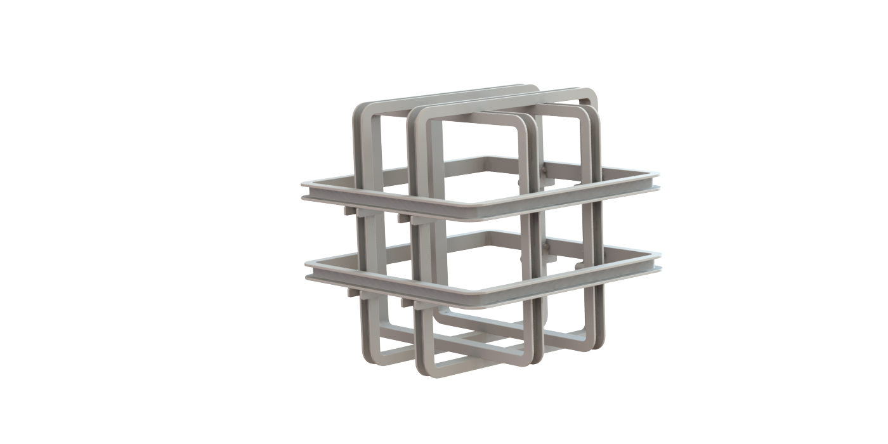

# Helmholtz Structure

This section covers the design of a Helmholtz coil structure.

## Author

[Jonathan Cochran](https://github.com/ionzzu)

## Description

### Background

A Helmholtz coil is a device to produce a region of uniform magnetic field. It is necessary in this project to test the CubeSat's on-board magnetorquers to tune the algorithm for producing current in each coil's axis.

### Goals

- Hold wrapped 24 AWG wire to generate a 3-dimensional magnetic field
- Manufacturable from 3D printing or wood fabrication
- Easily dis/assembled and compactly stored

### Design

- The structure is large enough such that a CubeSat may be maneuvered within it
- Complexity was minimized by reducing the assembled part types to 5
- Slats are large enough to be wrapped in 24 AWG wire
- Coil mounts are designed to nest within each other when disassembled
- All parts are designed such that they may be 3D printed
- Mount specifications are as similar as possible so as to produce a uniform magnetic field when coils are induced

## Assembly

See [Helmholtz Coil Structure directory](../helmholtz_coil_structure)

